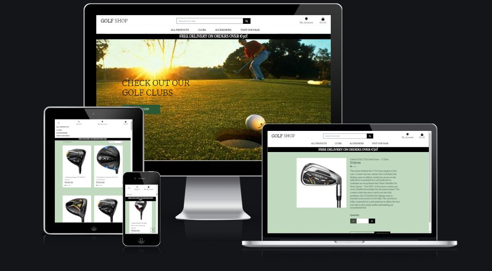
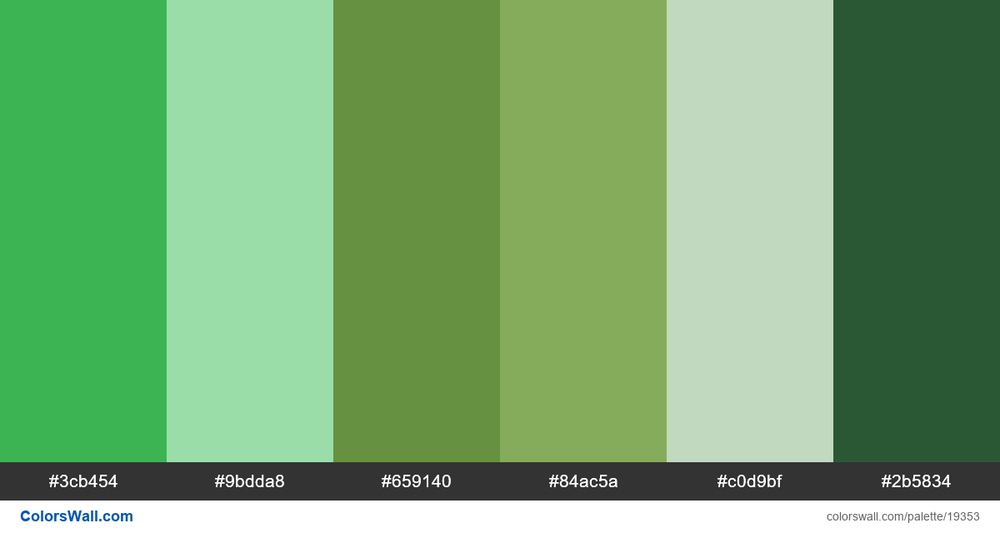

<h1 align="center">GolfShop</h1>



<span id="golfShop"></span>

The GolfShop is an online golf shop website that allows users to buy golf clubs and accessories.

Superusers can log in and add, edit and delete items in the shop.

I got inspraion from the application in the walk through that we did in this module, Botique Ado.

I used the walk through videos to help code the project.

**[View the live project here.](https://golfshopp5.herokuapp.com/)**

---

## Index 

- <a href="#introduction">1. Introduction</a>
- <a href="#ux">2. UX</a>
  - <a href="#ux-ideal-user-demographic">2.1 Ideal User Demographic</a>
  - <a href="#ux-user-stories">2.2 User Stories</a>
  - <a href="#ux-development-planes">2.3 Development Planes</a>
  - <a href="#ux-design">2.4 Design</a>
- <a href="#features">3. Features</a>
  - <a href="#features-existing">3.1 Existing features</a>
  - <a href="#features-future">3.2 Features left to implement in the future</a>
- <a href="#technologies">4. Technologies used</a>
- <a href="#testing">5. Testing</a>
- <a href="#deployment">6. Deployment</a>
- <a href="#credits">7. Credits</a>
- <a href="#Acknowledge">8. Acknowledge</a>

---

<span id="#introduction"></span>

<h1>1. Introduction</h1>

<span id="ux-goals"></span>

### 1.1 Project goals 

- Making a full-stack site that allows users to manage a common dataset about a particular domain. 
- Making a full-stack site that uses HTML, CSS, JavaScript, Python+Flask and PostGresDB.
- Creating a website that serves as a platform where people shop online, create an account and add items to the site. 
- Creating a website that is simple to understand and easy to navigate.

<span id="#ux"></span>

<h1>2. UX</h1>

<span id="ux-ideal-user-demographic"></span>

### 2.1 Ideal User Demographic 

**The ideal user of this website will be:**
-Golfers
-Looking for gift ideas
-Interested in Sports
-Interested in starting a new sport


<span id="ux-user-stories"></span>

### 2.2 User stories 

**First-time visitor goals:**
1. As a first time visitor, I want to be able to visit the website on every device, so that I can look at the website on desktop, mobile and tablet. 
2. As a first time visitor, I want to be able to navigate easily through the website, so I can find everything easily. 
3. As a first time visitor, I want to be able to search golf clubs by categories, so I can easily find the equipment I want. 
4. As a first time visitor, I want to register an account on the website, so I can buy golf accessories. 
5. As a first time visitor, I want to select a product so that I can get more information on that product.
6. As a first time visitor, I want to sort items so that I can view products in alphabetical order or price.

**Site member goals:** 

All the goals of first-time visitors also apply for site members. There are additional user stories to the site members because they have more access to the website. See the additional user stories below. 
1. As a site User I want to receive email confirmation after registering so that I know my registration was successful. 
2. As a site user I want to be able to enter my payment information so that I can purchase equipment.
3. As a site user I want to add items and remove items to my shopping bag so that i have the correct items in the bag
4. As a site user I want to view the total price of my items in the shopping bag so that I know what the total price will be.
5. As a site user I want to feel safe when i pay for my items so that i can give information to complete my purchase.
6. As a site user I want to give my email details so that i can be added to a group to get updated from company.
7. As a site user I want to go to the Facebook page so that I can see additional information about the shop.
8. As a site user, I want to logout to my profile. 


**Admin goals:**

All the goals of the first time visitors and site members also apply for the admin. The admin has additional user stories to manage the categories of the golf accessories. 
1. As an admin, I want to be able to add, edit and delete an item to the website.

<span id="ux-development-planes"></span>

### 2.3 Development Planes 

To create a website that would attract and engage users, the developer viewed other golf and sports websites for ideas for what features and functionality would be required.

### Main Inspirations

The botique Ado application and various golf and sports websites


And More....

### Strategy

Broken into three categories, the website will attempt to focus on the following target audiences:

**Roles:**

- first time visitor
- Site User
- Site Administrator

**Demographic:**

- Any age group
- Golfers
- Gift givers
- Sporty

**Psychographics:**

- Personality & Attitudes:

 - Sporty
 - Atheltic
 - Outgoing
 - Social

**Lifestyles:**

Is currently a golfer
Is interesred in taking up golf
Has friends or partner that is interested in golf
Likes golf style

The golf shop should enable the **Site User** to:

View different golf clubs and products
Arrange the items by price
Add and remove items to their shopping basket
Search for products
View more detail of a selected product

The golf shop app needs to enable the Site Owner to:

Add, remove and modify poducts on the site.

**eCommerce Application Type and Marketing Strategy**

To create a site that fit the user's needs, I planned the site using the following methods:

- **eCommerce Type:**

 - **B2C** - The marketing strategies used for this business were SEO (Search Engine Optimisation), Content Marketing in the form of a newsletter, and Social Media Marketing in the form of a Facebook page which link is in the application.

- **eCommerce Type:**

- **SEO** - SEO is useful for ensuring a good online presence, incredibly important today with people's dependence on technology. SEO must be carefully managed to not be treated as spam. This was done by avoiding keyword stuffing in the page content but filling the meta tag with valuable keywords and a useful description.

- **Content Marketing** - Content Marketing in the form of a newsletter was used. This form of marketing can be useful and engaging to the consumer. Content is created to attract a certain type of customer or relevant client to the store. It allows the store to show off its expertise and position itself as a reliable, trustworthy source of information and products. Other useful forms of content marketing are eBooks, webinars and blog posts.

- **Social Media Marketing** - Organic Social Media Marketing was chosen as a free and easy way to become identifiable in the community. The site can be shared with others and special events or sales can be shared free of charge. This form of marketing allows the store to connect directly with the consumer and build relationships and loyalty in the customer base. This form of marketing can also be used to improve the store's customer service and support. There is also the potential to add a paid service which will allow the store to be marketed by the social media provider to become more visible to a larger audience. The social media chosen for this project was Facebook.

**Scope**

A scope was defined to identify what needed to be done to align features with the strategy previously defined. This was broken into two categories:

**Content Requirements**

The user will be looking for:
- A list of clubs and golf accessories
- Be able to purchase a single club or a set of clubs and accessories
- Detailed information and images of the products
- A way to search the site using the name or description fields.

**Functionality Requirements**

The user will be able to:
- Choose a product or an accessory they want to get more infomrmation.
- Choose a product to purchose
- Browse the site to find product information.

**Skeleton**

Mockup designs are made with [Balsamic.](https://balsamiq.com/)

Click on the links below to view.
|    Mobile   |    Tablet / Desktop   | 
|    :----:    |     :----:   |   
|[golfShop](https://github.com/colmhaugh/GolfShop/blob/main/readme/balsamic/Golf%20for%20Android.bmpr)|[golfShop](https://github.com/colmhaugh/GolfShop/blob/main/readme/balsamic/Golfe%20for%20LargerScreens.bmpr) | 

<span id="ux-design"></span>

### 2.4 Design 

- #### Colour scheme 
I kept this website very neutral so that it doesnt take away from the golf images.  White for the header mild color scheme from colorwwall.com.   




- #### Fonts
The **Merriweather** are used throughout the whole website. Sans serif and cursive are the fallbacks in case the main font isn’t being imported to the site correctly.  

- #### Icons
In the project, for the golf club and user, I used the icons provided by [Font Awesome](https://fontawesome.com/).  

- #### Images
I collected the images from multiple sites including https://www.halpennygolf.com/. 

- #### Interactive design 

    - The website is basic and simple to use for the user.  Users can navigate the site easily and clearly find what they are looking for. 

<span id="ux-architecture"></span>

### 1.4 Information architecture
 I have crated a model for the categories and products and was able to add them using fitures using json files.  I have used allauth for my login and logout. 
 I have order models for the checkout and 

<span id="features"></span>

<h1>3. Features</h1>

<span id="features-existing"></span>

### 3.1 Existing features 

#### 1. Design 
- A basic, uncluttered layout with consistency.
- Simple navigation throughout the website by using the navigation bar. 
- Displaying nice images, description and proces of the products.

#### 2. General 
- The home page has a header where the user can login, log out or create an account. 
- Users can search for a club on using the search bar. 
- Users can select select from a tab what club or accessory they want to see. 
- Users can navigate to a facebook shop page to help SEO. 

#### 3. Product
- Logged in super user can add, edit or delete an item. 
- Users can arrange the items by price, category or name. 
- Users can select a product and add it to the bag. 

#### 4. Shopping Bag 
- Users can add or remove items from their shopping bag. 
- Users can buy the app from the website.

#### 5. Signup, login and logout 
- Like in the walkthrough, I have used allAuth for to handle the login and logout. 
- People can create a new account on the web application. 
- People can login with their existing accounts. 
- People can easily log out.


<span id="features-future"></span>

### 3.2 Features left to implement in the future 
- Extra style to be added.
- Facebook page to be updated.

<span id="technologies"></span>

<h1>4. Technologies used</h1>

#### Languages used
- [HTML5](https://en.wikipedia.org/wiki/HTML5)
    - HTML5 provides the structure and the content for my project. 
- [CSS3](https://en.wikipedia.org/wiki/Cascading_Style_Sheets)
    - CSS3 provides the style of the HTML5 elements.
- [jQuery](https://jquery.com/)
    - jQuery used as the JavaScript functionality.
- [Python](https://www.python.org/)
    - Python provides the backend of the project.
- [Django](https://www.djangoproject.com/)
    - Python-based framework that follows the model–template–views architectural pattern.


#### Frameworks, libraries & Other
- [Gitpod](https://www.gitpod.io/) 
    - The GitPod is used to develop the project.
- [Git](https://git-scm.com/)
    - The Git was used for version control to commit to Git and push to GitHub.
- [GitHub](https://github.com/)
    - The GitHub is used to host the project.
- [Balsamic](https://balsamiq.com/)
    - Balsamic is used to create the mockup designs for the project.
- [PostgreSQL](https://www.postgresql.org/)
    - PostgreSQL is the open Source Relational Database that was used for the project.
- [Heroku](https://dashboard.heroku.com/)
    - Heroki is the cloud platform to deploying the app.
- [AllAuth](https://django-allauth.readthedocs.io/en/latest/)
    - Django-allauth was used for registeration, login and log out.
- [AWS Amazon](https://aws.amazon.com/)
    - AWS Amazon is used to store static and media files.
- [Boto3](https://boto3.amazonaws.com/v1/documentation/api/latest/index.html)
    - Boto3 is used for compatibility in AWS.
- [Gunicorn](https://pypi.org/project/gunicorn/)
    - Gunicorn is used to enable deployment to Heroku.
- [Crispy Forms](https://django-crispy-forms.readthedocs.io/en/latest/)
    - Django Crispy Forms is used to style the Django forms
- [Stripe](https://stripe.com/en-nl)
    - Stripe is used for the secure payments.
- [SQlite3](https://www.sqlite.org/index.html)
    - SQlite3 is used as the development database.
- [PostgreSQL](https://www.postgresql.org/)
    - PostgreSQL is used as the production database.

#### Testing tools used 
- [Chrome DevTools](https://developers.google.com/web/tools/chrome-devtools/open) is used to detect problems and test responsiveness.
- [Autoprefixer](https://autoprefixer.github.io/)
    - Autoprefixer is used to parse the CSS and to add vendor prefixes to CSS rules. 
- [W3C Markup Validation Service](https://validator.w3.org/)
    - The W3C Markup Validation Service is used to check whether there were any errors in the HTML5 code. 
- [W3C CSS validator](https://jigsaw.w3.org/css-validator/)
    - The W3C CSS validator is used to check whether there were any errors in the CSS3 code.
- [JShint](https://jshint.com/)
    - JShint is a JavaScript validator that is used to check whether there were any errors in the JavaScript code. 
- [PEP8](http://pep8online.com/)
    - The PEP8 validator is used to check whether there were any errors in the Python code.

<span id="testing"></span>

<h1>5. Testing</h1>

## 1. Code validators
 - **[HTML Validator](https://validator.w3.org/):** Some errors due to django.
    - With testing the HTML code, I had some syntax issues on all pages I build with django templating.
    - I tested the HTML code by running my server locally and used view page source. This code I passed through the validator.
    - Some doctype errors that can be ingored as seen on slack chat.

- **[CSS Validator](https://jigsaw.w3.org/css-validator/):** No errors found.

- **[Python validator | PEP8](http://pep8online.com/):** No errors found

---

<span id="responsiveness"></span>

## 2. Responsiveness 
- Responsiveness of the project is tested with [Chrome DevTools](https://developers.google.com/web/tools/chrome-devtools).
- The project is tested on the following devices: 
    - Desktop, Mobile & Tablet.  
    - On ChromeDevTools used some of their devices for further testing.

---

## 4. Testing user stories 

1. As a user i want to click on a golf accessory so that I can see the the details of the product. 
    - The user can click on a product and a detail page will open with the details required.
2. As a user i want to view a paginated list of products so that I can select what product I want to view. 
    - The user will see see a set ammount of products depending on the screen size. 
3. As a user i want to add and remove items from my shopping basket.
    - A user add and remove products from basket. 
4. As a user i want to be able to search for a product.
    - A logged in user can enter text into the search bar and find a product they want.  
5. As an Administrator, i want to add, remove and edit a product so that other users can view my products.
    - I added products as an admin. 
6. As a user i want to be able to register an account.
    - I created and deleted test user accounts.  All this was handled by allAuth.
7. As a user i want to be able to list the products in different orders so that i can view the list order by price or category.
    - I added order functionality and tested in the app.


<h1>6. Deployment</h1>

#### Requirements 
- Python3 
- Github account 
- Heroku account

#### Clone the project 
To make a local clone, follow the following steps. 
1. Log in to GitHub and go to the repository. 
2. Click on the green button with the text **“Code”.**
3. Click on **“Open with GitHub Desktop”** and follow the prompts in the GitHub Desktop Application or follow the instructions from **[this link](https://docs.github.com/en/free-pro-team@latest/github/creating-cloning-and-archiving-repositories/cloning-a-repository#cloning-a-repository-to-github-desktop)** to see how to clone the repository in other ways. 


#### Heroku Deployment  
1. Set up local workspace for Heroku 
    - In terminal window of your IDE type: **pip3 freeze -- local > requirements.txt.** (The file is needed for Heroku to know which filed to install.)
    - In termial window of your IDE type: **python app.py > Procfile** (The file is needed for Heroku to know which file is needed as entry point.)
2. Set up Heroku: create a Heroku account and create a new app and select your region. 
3. Deployment method 'Github'
    - Click on the **Connect to GitHub** section in the deploy tab in Heroku. 
        - Search your repository to connect with it.
        - When your repository appears click on **connect** to connect your repository with the Heroku. 
    - Go to the settings app in Heroku and go to **Config Vars**. Click on **Reveal Config Vars**.
        - Enter the variables contained in your env.py file. it is about: **CLOUDINARY_URL, DATABASE_URL, SECRET_KEY**
4. Push the requirements.txt and Procfile to repository. 
     ```
    $ git add requirements.txt
    $ git commit -m "Add requirements.txt"

    $ git add Procfile 
    $ git commit -m "Add Procfile"
    ```
5. Automatic deployment: Go to the deploy tab in Heroku and scroll down to **Aotmatic deployments**. Click on **Enable Automatic Deploys**. By **Manual deploy** click on **Deploy Branch**.

Heroku will receive the code from Github and host the app using the required packages. 
Click on **Open app** in the right corner of your Heroku account. The app wil open and the live link is available from the address bar. 


<span id="credits"></span>

<h1>7. Credits</h1>

This project is based on the Botique Ado walkthrough project and also using project example Idea 2.  A lot of the code that I used in the walkthrough project I also used on this project.

#### Products
- I got the product images, price and details from various online golf shops, mainly [halpennygolf](https://www.halpennygolf.com/). 

#### Code
- Code Institute walkthrough project I think therefore I blog.

<span id="Acknowledge"></span>

<h1>8. Acknowledge</h1>

Thanks to the following people and organizations who helped or inspired me for the project:  
- The support from Kasia and my class mates.
- The support and guidance of my mentor Precious Ijege. 
- The lessons and knowledge of [Code Institute.](https://codeinstitute.net/)
- The advice about bugs from Slack community.

Thanks for visiting

<a href="#golfShop">Back to top!</a>